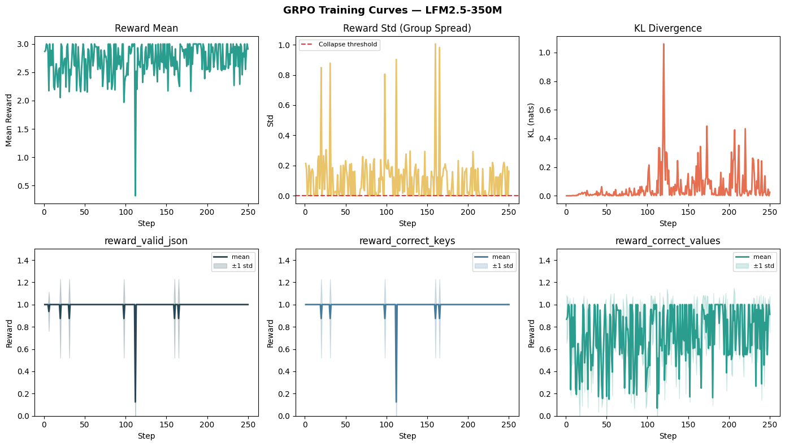

+++
title = 'Fine-tuning LFM2.5-1.2B-Instruct with GRPO'
date = 2026-06-15
[params]
subtitle = "How to fine-tune LFM2.5-1.2B-Instruct with GRPO and Unsloth on OCR receipt extraction for JSON"
math = true
+++

In this notebook, we will explore the core concepts of **GRPO (Group Relative Policy Optimization)** by fine-tuning [LFM2.5-1.2B-Instruct](https://huggingface.co/LiquidAI/LFM2.5-1.2B-Instruct) using [Unsloth](https://unsloth.ai).

**GRPO** is a reinforcement learning algorithm designed for training language models with reward signals instead of labeled examples. In contrast to supervised fine-tuning (SFT), where you tell the model the exact right answer, GRPO lets the model *explore* different outputs and reinforces the ones that score higher on the reward functions. Thatâ's why GRPO is ideal for verifiable tasks where you can programmatically evaluate the correctness of model outputs, such as math problems, code generation, and structured data tasks.

**LFM2.5-1.2B-Instruct** is a general-purpose instruction-tuned model. Since it is quite small, it is suitable for agentic tasks, data extraction, and RAG but less so for knowledge-intensive tasks and programming.

In this example, LFM2.5-1.2B-Instruct learns to extract structured invoice fields from noisy OCR text. The outputs are easy to verify programmatically for GRPO: we can reward the model for producing valid JSON, using the right schema, and recovering the correct values.

## Prerequisites

To run this tutorial as a notebook, you will need:

- **GPU** for fine-tuning .If you donâ't have one locally, you can run this notebook for free on [Google Colab](https://colab.research.google.com/github/Liquid4All/cookbook/blob/main/finetuning/notebooks/grpo_with_unsloth.ipynb) using a free NVIDIA T4 GPU instance or on [Kaggle](https://www.kaggle.com/)
- Optional: `HF_TOKEN` for faster downloads of the training dataset from Hugging Face.

*Note: This notebook as trained on a free Colab notebook using a NVIDIA T4 GPU. (Torch: 2.10.0+cu128, CUDA: 7.5., CUDA Toolkit: 12.8., Triton: 3.6.0)*

``` python
import torch

assert torch.cuda.is_available(), "No GPU detected. Make sure you've enabled GPU in Colab: Runtime > Change runtime type > T4 GPU"
```

## Setup

Install the required packages (Unsloth `v2026.4.8`, Transformers `v4.57.6`, vLLM `v0.19.1`, trl `v0.24.0`).

``` python
!pip install -qU unsloth trl vllm transformers datasets matplotlib
```

Additionally, we will set `UNSLOTH_VLLM_STANDBY`, which enables a lower-VRAM standby mode and reduces GPU memory usage. We will also fix the random seed.

``` python
import os
os.environ['UNSLOTH_VLLM_STANDBY'] = "1" # Unsloth Standby reduces VRAM by 30%+

SEED = 42
```

## Load Model and Tokenizer

We load **LFM2.5-1.2B-Instruct** as the base model, including the tokenizer. Then we apply LoRA adapters.

``` python
from unsloth import FastLanguageModel

MODEL_NAME     = "unsloth/LFM2.5-1.2B-Instruct"
max_seq_length = 4096   # Must be larger than prompt_length for max_new_tokens to be greater than 0
lora_rank      = 32#16    # # Choose any number > 0 ! Suggested 8, 16, 32, 64, 128 (higher rank = smarter, but slower)

# Load model
model, tokenizer = FastLanguageModel.from_pretrained(
    model_name      = MODEL_NAME,
    max_seq_length  = max_seq_length,
    load_in_4bit = False,       # False for LoRA 16bit
    fast_inference = False,     # Enable vLLM fast inference
    max_lora_rank = lora_rank,
    load_in_fp8 = False,        # Float8 RL / GRPO!
)

# Inject LoRA adapters into attention and MLP layers
model = FastLanguageModel.get_peft_model(
    model,
    r = lora_rank,
    target_modules = [
        "q_proj", "k_proj", "v_proj", "out_proj",   # Attention layers
        "in_proj",                                  # Conv layers
        "w1", "w2", "w3",                           # FFN
    ],
    lora_alpha = lora_rank*2,              # Scaling factor for LoRA updates
    use_gradient_checkpointing = "unsloth",        # Reduces memory usage 
    random_state = SEED,
)

# Count trainable parameters
trainable = sum(p.numel() for p in model.parameters() if p.requires_grad)
total     = sum(p.numel() for p in model.parameters())
print(f"Trainable params : {trainable:,} ({100*trainable/total:.1f}% of total)")
print(f"Total params     : {total:,}")
```

    🦥 Unsloth: Will patch your computer to enable 2x faster free finetuning.

    2026-05-04 19:06:21.934230: E external/local_xla/xla/stream_executor/cuda/cuda_fft.cc:467] Unable to register cuFFT factory: Attempting to register factory for plugin cuFFT when one has already been registered
    WARNING: All log messages before absl::InitializeLog() is called are written to STDERR
    E0000 00:00:1777921582.153165      57 cuda_dnn.cc:8579] Unable to register cuDNN factory: Attempting to register factory for plugin cuDNN when one has already been registered
    E0000 00:00:1777921582.216471      57 cuda_blas.cc:1407] Unable to register cuBLAS factory: Attempting to register factory for plugin cuBLAS when one has already been registered
    W0000 00:00:1777921582.738130      57 computation_placer.cc:177] computation placer already registered. Please check linkage and avoid linking the same target more than once.
    W0000 00:00:1777921582.738168      57 computation_placer.cc:177] computation placer already registered. Please check linkage and avoid linking the same target more than once.
    W0000 00:00:1777921582.738171      57 computation_placer.cc:177] computation placer already registered. Please check linkage and avoid linking the same target more than once.
    W0000 00:00:1777921582.738173      57 computation_placer.cc:177] computation placer already registered. Please check linkage and avoid linking the same target more than once.

    🦥 Unsloth Zoo will now patch everything to make training faster!
    ==((====))==  Unsloth 2026.4.8: Fast Lfm2 patching. Transformers: 4.57.6. vLLM: 0.19.1.
       \\   /|    Tesla T4. Num GPUs = 2. Max memory: 14.563 GB. Platform: Linux.
    O^O/ \_/ \    Torch: 2.10.0+cu128. CUDA: 7.5. CUDA Toolkit: 12.8. Triton: 3.6.0
    \        /    Bfloat16 = FALSE. FA [Xformers = 0.0.35. FA2 = False]
     "-____-"     Free license: http://github.com/unslothai/unsloth
    Unsloth: Fast downloading is enabled - ignore downloading bars which are red colored!
    Unsloth: QLoRA and full finetuning all not selected. Switching to 16bit LoRA.

    Trainable params : 22,216,704 (1.9% of total)
    Total params     : 1,192,557,312

## Data Preparation

For this tutorial, we use the [Navneetkumar11/rvl-cdip-invoice-extracted](https://huggingface.co/datasets/Navneetkumar11/rvl-cdip-invoice-extracted) dataset from Hugging Face. This is a OCR extraction dataset. Each example contains raw OCR text from a scanned invoice plus a normalized JSON extraction target.

Letâ's load and preprocess the dataset. We train on a compact invoice header schema with only two keys `invoice_date` and `total_amount`.

``` python
from datasets import load_dataset
import json

dataset = load_dataset("Navneetkumar11/rvl-cdip-invoice-extracted", split="train")
dataset = dataset.filter(lambda ex: ex["extraction_confidence"] == "high")

def format_dataset(example):
    try:
        extracted = json.loads(example["extracted"])
    except (TypeError, ValueError, json.JSONDecodeError):
        extracted = None

    return {
        "text": example["raw_ocr_text"],
        "ground_truth_invoice_dates": str(extracted.get("invoice_date")).strip() if extracted.get("invoice_date") else None,
        "ground_truth_total_amounts": float(extracted.get("total_amount")) if extracted.get("total_amount") else None,
    }

dataset = dataset.map(format_dataset)

# Filter out entries with missing values
dataset = dataset.filter(lambda ex: all(ex[k] is not None for k in [ "ground_truth_invoice_dates", "ground_truth_total_amounts"]))

# Remove unused columns
dataset = dataset.remove_columns(
    [c for c in dataset.column_names if c not in [
        "text",
        "ground_truth_invoice_dates",
        "ground_truth_total_amounts",
    ]]
)

# Shuffle and split data into training and evaluation datasets
dataset = dataset.shuffle(seed=SEED)
train_ds = dataset.select(range(1500))
eval_ds = dataset.select(range(1500, 1600))

dataset
```

    Dataset({
        features: ['text', 'ground_truth_invoice_dates', 'ground_truth_total_amounts'],
        num_rows: 2404
    })

``` python
dataset[0]
```

    {'text': 'P\nROMOTIONS\nON THE OCEAN INC.\n4205 Pleasant Valley Rd.\nSuite 167\nRaleigh, NC 27612\nAugust 1, 1995\nPROMOTIONS ON THE OCEAN, INC.\nINVOICE # LOR 3-95\nLORILLARD PO # 3119\nDate:\nJune 1-June 31, 1995\nEvent/Location: Newport Summer Nightclub Promotion/Virginia Beach, VA\nDescription:\nNightclub Sampling & Promotional Activities\nCasting, selection & training of models for sampling and activities.\n# Days:\n9\nAvg. duration of days:\n3.5 Hrs.\nAvg. # Supervisors:\n2\nAvg. # Supervisors day rate: $73.50\nTOTAL COSTS: $1,323.00\nPor 8/3\n18 stulas\nLegit\n93114516\nNorth Myrtle Beach, SC - Virginia Beach, VA - Myrtle Beach, SC :unselected:',
     'ground_truth_invoice_dates': '1995-08-01',
     'ground_truth_total_amounts': 1323.0}

## Format Prompts (Chat Template)

Because GRPOâ's trainer expects a dataset where each row has a `"prompt"` field, we will format the prompts using a chat template. LFM2.5 uses a ChatML-style format, where every conversation is wrapped in special tokens:

    <|im_start|>system
    You are a helpful assistant.<|im_end|>
    <|im_start|>user
    What is 2+2?<|im_end|>
    <|im_start|>assistant

The model then generates from the `assistant` position onward.

In the system prompt we define how the model should the exact schema, how to handle missing fields, and what normalization to apply.

``` python
SYSTEM_PROMPT = """You extract structured invoice header data from OCR text.

Return a JSON object with exactly this kes and no others:
- "invoice_date": string in YYYY-MM-DD format or null
- "total_amount": JSON number or null

Rules:
- Output exactly one JSON object.
- Do not include markdown fences.
- Do not include explanations.
- Do not include any extra keys.
- Do not invent values.
- Do not use commas in numbers.
- total_amount must be a JSON number, not a string.
- Use null when a field is missing or unclear.
"""

def format_prompt(example):
    """Convert a dataset row into a ChatML-formatted prompt string."""
    messages = [
        {"role": "system", "content": SYSTEM_PROMPT},
        {"role": "user",   "content": example["text"]},
    ]

    prompt = tokenizer.apply_chat_template(
        messages,
        tokenize=False,
        add_generation_prompt=True
    )
    return {"prompt": prompt}

train_ds = train_ds.map(format_prompt)
eval_ds  = eval_ds.map(format_prompt)
```

Below you can see an example of the `prompt` field using the ChatML template:

``` python
ex = train_ds[0]
print("--- Raw OCR text (input) ---")
print(ex["text"][:300])

print("\n--- Formatted prompt (what the model sees) ---")
print(ex["prompt"][:500])
```

    --- Raw OCR text (input) ---
    P
    ROMOTIONS
    ON THE OCEAN INC.
    4205 Pleasant Valley Rd.
    Suite 167
    Raleigh, NC 27612
    August 1, 1995
    PROMOTIONS ON THE OCEAN, INC.
    INVOICE # LOR 3-95
    LORILLARD PO # 3119
    Date:
    June 1-June 31, 1995
    Event/Location: Newport Summer Nightclub Promotion/Virginia Beach, VA
    Description:
    Nightclub Sampling & Pr

    --- Formatted prompt (what the model sees) ---
    <|startoftext|><|im_start|>system
    You extract structured invoice header data from OCR text.

    Return a JSON object with exactly this kes and no others:
    - "invoice_date": string in YYYY-MM-DD format or null
    - "total_amount": JSON number or null

    Rules:
    - Output exactly one JSON object.
    - Do not include markdown fences.
    - Do not include explanations.
    - Do not include any extra keys.
    - Do not invent values.
    - Do not use commas in numbers.
    - total_amount must be a JSON number, not a string.
    - Use nul

## Define the Reward functions

Reward functions are the key ingredients for GRPO. They let us know if the model doing well or not.

For this example, we will define three reward functions, each with a distinct learning signal:

- **JSON structure**: did the model return the right schema?
- **Field presence**: did it contain the correct fields?
- **Field quality**: are the values correct? If not, are they close to the desired value?

General best practices for reward functions are:

- Provide clear signals with partial credit where possible
- Be deterministic and consistent
- Execute quickly for training efficiency
- Fail gracefully when the model emits malformed JSON

### R1: JSON Structure Reward

This reward function teaches the model that structure matters before content does:

- If the output is valid JSON -\> **+1**
- If the output becomes valid after light cleanup like removing code fences or extra surrounding text -\> **+0.5**
- Not valid even after clean up -\> **no reward**

``` python
import json
import re

def _clean_json(text: str) -> str:
    text = text.strip()

    # Strip code fences
    if text.startswith("```"):
        text = re.sub(r"^```(?:json)?\s*", "", text, flags=re.IGNORECASE)
        text = re.sub(r"\s*```$", "", text)
    text = text.strip()

    # Extract JSON object by braces
    start, end = text.find("{"), text.rfind("}")
    if start != -1 and end != -1 and end > start:
        text = text[start:end+1]

    return text.strip()
    
def reward_valid_json(completions, **kwargs):
    scores = []
    for completion in completions:
        response = completion if isinstance(completion, str) else completion[0]["content"]

        try:
            json.loads(response)
            scores.append(1.0)        # clean valid JSON
        except json.JSONDecodeError:
            # Second pass: try light cleanup for common model/OCR numeric issues
            try:
                json.loads(_clean_json(response))
                scores.append(0.5)    # valid after cleaning (had ``` etc.)
            except json.JSONDecodeError:
                scores.append(0.0)    # invalid JSON
    return scores
```

### R2: Key Presence Reward

This reward function teaches the model to follow the target schema, not just produce any JSON:

- If the output contains exactly the expected keys, `invoice_date` and `total_amount` -\> **+1**
- If it contains the expected keys plus extra unwanted keys -\> **+0.5**
- If it includes only some of the expected keys -\> **+0.2**
- If it includes none of the expected keys, or the output still is not valid JSON -\> **no reward**

``` python
EXPECTED_KEYS = {"invoice_date", "total_amount"}

def reward_correct_keys(completions, **kwargs):
    scores = []
    for completion in completions:
        response = completion if isinstance(completion, str) else completion[0]["content"]
        response = _clean_json(response)
        try:
            data = json.loads(response)
            keys = set(data.keys())
            if keys == EXPECTED_KEYS:
                scores.append(1.0)    # exact match
            elif EXPECTED_KEYS.issubset(keys):
                scores.append(0.5)    # correct keys + extra keys
            elif EXPECTED_KEYS & keys:
                scores.append(0.2)    # some correct keys
            else:
                scores.append(0.0)
        except (json.JSONDecodeError, AttributeError):
            scores.append(0.0)
    return scores
```

### R3: Field Quality Reward

This reward function teaches the model that getting the actual field values right matters most:

For `invoice_date`:

- If using the target `YYYY-MM-DD` format earns **+0.1**
- If the predicted date is an exact match with the ground truth -\> **+0.9**
- If the date is not exact but still parses as a real date, the model gets partial credit for each correct component:
  - Correct year -\> **+0.1**
  - Correct month -\> **+0.1**
  - Correct day -\> **+0.1**

For `total_amount`:

- If producing any valid numeric value earns **+0.1**
- The closer the predicted amount is to the ground-truth amount, the more reward it gets, up to **+0.2**
- If the amount is an exact match -\> **+0.7**
- If the output is not valid JSON, or the values cannot be parsed, those parts receive **no reward**

The final score is divided by `2` so the overall reward stays in a controlled range.

``` python
from datetime import datetime
from dateutil import parser

def reward_correct_values(completions, 
                          ground_truth_invoice_dates, 
                          ground_truth_total_amounts, 
                          **kwargs):
    scores = []
    for completion, date_gt, amount_gt in zip(
        completions, ground_truth_invoice_dates, ground_truth_total_amounts
    ):
        response = completion if isinstance(completion, str) else completion[0]["content"]
        response = _clean_json(response)

        try:
            data = json.loads(response)
        except (json.JSONDecodeError, AttributeError):
            scores.append(0.0)
            continue

        score = 0.0

        # Invoice date: ISO format + partial credit per matching component
        date_str = str(data.get("invoice_date", ""))
        gt_parsed = datetime.strptime(date_gt, "%Y-%m-%d")
        
        try:
            # Follows the correct format
            parsed_date = datetime.strptime(date_str, "%Y-%m-%d")
            score += 0.1
        except ValueError:
            try:
                # Doesn't follow the correct format but is a valid date
                parsed_date = parser.parse(date_str.strip(), fuzzy=False)
            except Exception:
                parsed_date = None

        if parsed_date == gt_parsed: # Exact match
            score +=0.9
        else:
            if parsed_date: # Approximate match
                if parsed_date.year  == gt_parsed.year:  score += 0.1
                if parsed_date.month == gt_parsed.month: score += 0.1
                if parsed_date.day   == gt_parsed.day:   score += 0.1
        
        # Total amount: scaled by closeness to ground truth
        try:
            amount = float(data.get("total_amount"))
            score += 0.1
            gt_amount = float(amount_gt)
            if gt_amount == 0: # div0 check
                amount_score = 1.0 if amount == 0 else 0.0
            else:
                deviation = abs(amount - gt_amount) / abs(gt_amount)
                amount_score = max(0.0, 1.0 - deviation)
            score += (0.2) * amount_score
            
            if amount == gt_amount: # Exact match
                score += 0.7
        except (TypeError, ValueError, AttributeError):
            pass  # not a valid number, no credit

        score /= 2
        scores.append(score)
    return scores
```

After scoring a group of G responses, GRPO computes each responseâ's **advantage**. The advantage describes how much better or worse it was than the group average, normalized by the groupâ's spread:

    A(i) = (r(i) - mean(r)) / std(r)

Responses with positive advantages get reinforced, while responses with negative advantages get suppressed. Thatâ's why having a `std=0` is not ideal because then the responsesâ' advantages are also 0. That also means, the group serves as a baseline without any need for a critic network.

## Configure and Run GRPO Training

Now we configure the GRPO training hyperparameters with the following key configurations:

- `num_generations`: how many responses per prompt. Higher values lead to better advantage estimates, but linearly more VRAM and compute.
- `beta`: penalty for diverging from the reference policy. Higher → model stays closer to base model. Lower → more aggressive learning (risk of collapse).
- `learning_rate`: very low because the LoRA weights are already close to useful.
- `max_steps`: total number of training steps.

``` python
from vllm import SamplingParams
from trl import GRPOConfig
import numpy as np

def prompt_token_length(example):
    token_ids = tokenizer(example["prompt"], add_special_tokens=False)["input_ids"]
    return {"prompt_length_tokens": len(token_ids)}

tokenized = train_ds.map(prompt_token_length)

maximum_length = int(np.quantile(tokenized["prompt_length_tokens"], 0.9))
print("90th percentile prompt length (tokens) =", maximum_length)
print("Max completion length =", min(max_seq_length - maximum_length - 1, 128))

max_prompt_length = maximum_length + 1 # + 1 just in case!
max_completion_length = min(max_seq_length - max_prompt_length, 128)

vllm_sampling_params = SamplingParams(
    min_p = 0.1,
    top_p = 1.0,
    top_k = -1,
    seed = SEED,
    stop = [tokenizer.eos_token],
    include_stop_str_in_output = True,
)

training_args = GRPOConfig(
    vllm_sampling_params = vllm_sampling_params,
    temperature = 1.0,
    learning_rate = 5e-6,
    weight_decay = 0.01,
    warmup_steps = 15,
    lr_scheduler_type = "linear",
    optim = "adamw_8bit",
    logging_steps = 1,
    per_device_train_batch_size = 4,
    gradient_accumulation_steps = 2, # Increase to 4 for smoother training
    num_generations = 8, # Decrease if out of memory
    beta = 0.1,  # increase kl_coef from default 0.04 to penalize KL drift more
    max_prompt_length = max_prompt_length,
    max_completion_length = max_completion_length,
    # num_train_epochs = 1, # Set to 1 for a full training run
    max_steps = 250,
    save_steps = 100,
    report_to = "none", # Can use Weights & Biases
    output_dir = "outputs",

    # For optional training + evaluation
    # fp16_full_eval = True,
    # per_device_eval_batch_size = 4,
    # eval_accumulation_steps = 1,
    # eval_strategy = "steps",
    # eval_steps = 1,
)
```

    90th percentile prompt length (tokens) = 730
    Max completion length = 128

Now we wire everything together in the `GRPOTrainer`. During training the GRPO trainer handles sampling `G` completions per prompt, calling the reward function, computing advantages, computing the GRPO policy gradient loss and KL penalty, and updating the LoRA weights.

Instead of consolidating the three reward functions into a single `reward_fn`, we pass them separately for more transparent logging. We also add some weighting to the reward functions, since `reward_valid_json` and `reward_correct_keys` saturate quite quickly.

``` python
from trl import GRPOTrainer

trainer = GRPOTrainer(
    model = model,
    processing_class = tokenizer,
    reward_funcs = [reward_valid_json,
                    reward_correct_keys,
                    reward_correct_values],
    reward_weights=[0.5, 0.5, 2.0],  # upweight values
    args = training_args,
    train_dataset = train_ds,

    # For optional training + evaluation
    # train_dataset = new_dataset["train"],
    # eval_dataset = new_dataset["test"],
)

trainer.train()
```

**What a healthy GRPO training curve looks like:**

- **Reward mean** should rise steadily
- **Reward std** should stay non-zero (if it collapses to 0, all responses in every group are tied, the advantage = 0, and the gradient vanishes)
- **KL divergence** should grow slowly and stabilize. Spikes indicates the model has diverged too far from the reference policy. This means, either the learning rate is too high or `kl_coef` is too low



These curves show that the model learns the output format very quickly: `reward_valid_json` and `reward_correct_keys` stay close to 1, so most generations are valid JSON with the right schema. The noisier \`reward_correct_values curve tells the more interesting story, since extracting the exact invoice date and amount from OCR is the hard part and remains the main source of variation throughout training. The KL curve rises with a few spikes, which is normal here and suggests the model is changing meaningfully from the base policy without becoming obviously unstable.

A natural next step would be to strengthen the reward function so it reflects real extraction quality more sharply, especially by rewarding exact value matches more and giving less credit to partially correct but still misleading dates or amounts. After that, Iâ'd try a slightly longer run with a bit more data or a cleaner subset of the OCR examples, since this model already seems to have learned the JSON format and now mostly needs help improving value accuracy.

## Save Checkpoint

Before evaluation, we will save the fine-tuned model. For this, we only have to save the LoRA adapter, as the base model weights remain unchanged and do not need to be saved.

``` python
FINAL_ADAPTER_PATH = "./grpo_lfm2.5_invoice_adapter"

# Save the final LoRA adapter from the current fine-tuned model
model.save_pretrained(FINAL_ADAPTER_PATH)
tokenizer.save_pretrained(FINAL_ADAPTER_PATH)
```

    ('./grpo_lfm2.5_invoice_adapter/tokenizer_config.json',
     './grpo_lfm2.5_invoice_adapter/special_tokens_map.json',
     './grpo_lfm2.5_invoice_adapter/chat_template.jinja',
     './grpo_lfm2.5_invoice_adapter/tokenizer.json')

## Inference and Evaluation

Letâ's compare the **base model** and the **GRPO fine-tuned model** on a few held-out examples from `eval_ds` to see if the fine-tuned model actually is an improvement over the base model.

For this, we first load both the base model and the fine-tuned model.

``` python
# Load a fresh base model for comparison
base_model, base_tokenizer = FastLanguageModel.from_pretrained(
    model_name=MODEL_NAME,
    max_seq_length=max_seq_length,
    load_in_4bit=True,
)

FastLanguageModel.for_inference(base_model)

# Load the saved fine-tuned adapter as a fresh model for comparison
ft_model, ft_tokenizer = FastLanguageModel.from_pretrained(
    model_name=FINAL_ADAPTER_PATH,
    max_seq_length=max_seq_length,
    load_in_4bit=True,
)

FastLanguageModel.for_inference(ft_model)
```

:::

Let's look at a few examples:

    ==================================================
    Example 1

    Ground truth:
    "CUSTOMER NO.\nLENGER\nDTV.\nVENDOR NO.\nCREDIT DATE\n1276900000\n62\n0616\n0000013554\n01/20/95\nSOLD TO\nSHIP TO\nFAIRMONT WHOLESALE INC\nFAIRMONT WHOLESALE INC\nPO BOX 905\n000 NO NORTH AVE\nFAIRMONT\nMN56031\nFAIRMONT\nHN56031\nTHIS IS NOT A CREDIT MEMO - CHECK ATTACHED\nQUANTITY\n(IN THOUSANDS)\nBRAND NAME\nAMOUNT\n6\nTRUE HEN K\n335,79\n6\nTRUE MEN 1\n335,70\n6\nSTYLE LT I\n335,70\n6\nSTYLE MNLT\n335,70\n6\nSTYLE LT M\n335.70\n1.2\nSTYLE LT F\n671,40\nTOTALS-\n42\n2,349.90\nLORILLARD PLUS DISBURSEMENT IS\n$1.30 OF TOTAL QUANTITY - THANK YOU\nGROSS AMOUNT -\n54.60\nNET AMOUNT -\n54.60\nGROSS AMOUNT REFLECTS LIST PRICE AS OF PURCHASE DATE\n95602449"
    {
      "invoice_dates": "1995-01-20",
      "total_amount": 2349.9
    }

    Base model output:
    {
      "invoice_date": "2025-01-20",
      "total_amount": 2349000
    }
    R1=1.000 | R2=1.000 | R3=0.200 

    Fine-tuned model output:
    {
      "invoice_date": "1995-01-20",
      "total_amount": 2349.90
    }
    R1=1.000 | R2=1.000 | R3=1.000 

    ==================================================
    Example 2

    Ground truth:
    "PRO BILLIARDS\nTOUR\nINVOICE\nDATE:\nMarch 20, 1997\nACCOUNT:\nSports Marketing Enterprises\nP.O. Box 2955\nWinston-Salem, N.C. 27102\nPRODUCT:\nBusiness License.\nDESCRIPTION:\n1/2 cost of license for Camel/RJR booth space at\nSands Regency XXIII (June 1996)\nAMOUNT:\n$300.00\nAMOUNT DUE:\n$300.00\nPAYABLE TO:\nSands Regency Hotel Casino\n345 N. Arlington Ave.\nReno, Nv. 89501\nDATE DUE:\nApril 15, 1997\nPRIVILEGED MATERIAL REDACTED\n51809 5560\n4412 Commercial Way . Spring Hill, Florida 34606 . (352) 596-7808 \u00b7 Fax (352) 596-7441\nVisit our website: www.propool.com"
    {
      "invoice_dates": "1997-03-20",
      "total_amount": 300.0
    }

    Base model output:
    {
      "invoice_date": "1997-03-20",
      "total_amount": null
    }
    R1=1.000 | R2=1.000 | R3=0.500 

    Fine-tuned model output:
    {
      "invoice_date": "1997-03-20",
      "total_amount": 300.00
    }
    R1=1.000 | R2=1.000 | R3=1.000 

    ==================================================
    Example 3

    Ground truth:
    "ORIGINAL INVOICE\n\u0130\u0130TR\u0130\nHIT RESEARCH INSTITUTE\n50534\n#7622\nLorillard Research Center\n420 English St.\nGreensboro, NC 27405\nAttn: Dr. Thomas A. Vollmuth\nPLEASE REFER TO OUR INVOICE NUMBER\nAND REMIT TO:\nP. O. BOX 92003\nCHICAGO, ILLINOIS 60675\nDATE\nPROJECT No.\nACCOUNT NUMBER\nCONTRACT OR P. O. No.\nTERMS\n6/26/89\nL08170\n112-10 :selected:\ncr\n348B\nNET CASH\nAcute Toxicity Study in Rats\nRange Finding & LD50 Compound\nA262\n$ 4,150.00\nA268\n4,150.00\nA270\n4,150.00\nOK\n\u041d\u0410. \u0422\u0438\u043c\u0435\u043f\u0430\u0434\u0430\n7-5-890\nDept. 8700\nAcct. 4111 :selected:\nAMOUNT DUE $12,450.00\nFORM 583\n87148148 :unselected: :unselected: :unselected: :unselected:"
    {
      "invoice_dates": "1989-06-26",
      "total_amount": 12450.0
    }

    Base model output:
    {
      "invoice_date": "2029-06-26",
      "total_amount": 4120500
    }
    R1=1.000 | R2=1.000 | R3=0.200 

    Fine-tuned model output:
    {
      "invoice_date": "1990-06-26",
      "total_amount": 4150.00
    }
    R1=1.000 | R2=1.000 | R3=0.233 

As you can see, the fine-tuned model isnâ't perfect (for example, it gets the `total_amount` in the last example wrong) but it is performing much better at many of the extraction tasks than the base model.

## Push to Hugging Face Hub

To push your model to the Hugging Face Hub, uncomment the lies below and fill in your repository name.

``` python
# model.push_to_hub("your-username/lfm2.5-350m-grpo-invoice-extractor")
# tokenizer.push_to_hub("your-username/lfm2.5-350m-grpo-invoice-extractor")
```

## Summary

In this notebook, we explored the key principles of a small GRPO fine-tuning pipeline to fine-tune LFM2.5-1.2B-Instruct to extract JSON from raw OCR text using Unsloth. The main goal was to teach the model to produce more accurate structured outputs, with rewards based on whether the response is valid JSON, contains the right keys, and predicts the correct values.

The training pipeline in this notebook is intended for learning purposes and thus the fine-tuned model still has room for improvement. For better results, I recommend revisiting the reward functions, training for at least 300 steps (which may take about 30 minutes on a T4), and experimenting with hyperparameter tuning.

## References

- Unsloth Documentation. [Liquid LFM2.5: How To Run & Fine-tune](https://unsloth.ai/docs/models/tutorials/lfm2.5)
- Unsloth Documentation. [Tutorial: Train your own Reasoning model with GRPO](https://unsloth.ai/docs/get-started/reinforcement-learning-rl-guide/tutorial-train-your-own-reasoning-model-with-grpo)
- Project's Notebook. [Fine-tuning LFM2.5-1.2B-Instruct with GRPO](https://www.kaggle.com/code/iamleonie/fine-tuning-lfm2-5-1-2b-instruct-with-grpo) 

Back to top